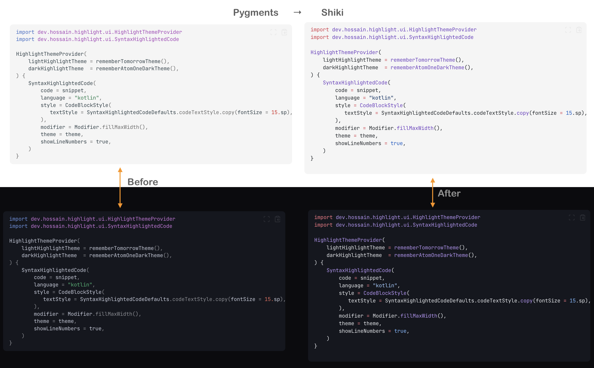

Recently, I used [Zensical](https://zensical.org/) for my [new Compose Highlight library](/posts/syntax-highlighting-on-android-highlight-js-native-compose-engine/) and noticed Kotlin syntax highlighting was not fully accurate.
I did a quick search to see whether I could change the highlighting pipeline on a Zensical site, but I could not find much documentation.
Then I asked in the Discord community, and someone shared a helpful clue in this thread: [Shiki highlighting discussion](https://discord.com/channels/1289187620659789824/1506439799500701768/1506439799500701768).
That pointed me to a Shiki-based JavaScript approach that worked really well.

My Zensical based [docs site](https://hossain-khan.github.io/android-compose-highlight/) already had build-time highlighting with Pygments which for most Kotlin code blocks was good enough,
but I wanted to see if I could improve it without breaking the existing setup.

In this post, I will share how I added Shiki support for Kotlin code blocks without breaking Zensical's existing code block UI.

> [!IMPORTANT]
> Zensical is still in an early stage. At the time of writing this post, the current release is `0.0.43`. There may be a native way to handle this in a future release, so treat this approach as a practical workaround for now.

## The highlighting overhaul

Based on the hint provided on the Discord site, I took a hybrid approach:

1. Keep Pygments as the default highlighter for all languages at build time.
2. Re-highlight only Kotlin blocks on the client side with Shiki.
3. Preserve the existing `<pre>` and wrapper structure so copy buttons and layout keep working.

That gave me better Kotlin tokenization while keeping the stability of the current Zensical pipeline.

> 💡 Tip: If your docs site already has working build-time highlighting, this incremental approach is much safer than swapping the whole highlighting system in one go.

### Technical details

Here are the key changes made to achieve the new highlighting on top of Pygments:

- `docs/javascripts/shiki-kotlin.js` (new)
- `docs/stylesheets/shiki-kotlin.css` (new)
- `zensical.toml` (updated to load both assets)

The script scans code blocks, detects Kotlin blocks, asks Shiki to render highlighted HTML, and then swaps only the inner `<code>` content.

That "swap only inner HTML" decision mattered a lot because Zensical's existing wrappers handle extra UI behavior (like copy actions).
Replacing the whole block would have been risky.

Here is the complete implementation of the highlighting script:

```js
import { codeToHtml } from "https://esm.sh/shiki@4.1.0";

// Finds Kotlin code blocks rendered by Pygments and re-highlights them with Shiki.
// Only swaps inner <code> content - preserves the <pre> and wrapper <div> so that
// Zensical's copy buttons, positioning, and background styling remain intact.
async function highlightKotlinBlocks() {
  const wrappers = document.querySelectorAll(
    "div.language-kotlin.highlight, div.language-kt.highlight"
  );

  if (wrappers.length === 0) return;

  for (const wrapper of wrappers) {
    if (wrapper.hasAttribute("data-shiki-done")) continue;

    const pre = wrapper.querySelector("pre");
    if (!pre) continue;

    const block = pre.querySelector("code");
    if (!block) continue;

    const code = block.textContent;

    try {
      const html = await codeToHtml(code, {
        lang: "kotlin",
        themes: {
          light: "one-light",
          dark: "one-dark-pro",
        },
        defaultColor: false,
      });

      const tempDiv = document.createElement("div");
      tempDiv.innerHTML = html;

      const shikiPre = tempDiv.querySelector("pre");
      if (!shikiPre) continue;

      const shikiCode = shikiPre.querySelector("code");
      if (!shikiCode) continue;

      // Swap just the code innerHTML and apply Shiki's CSS variables to existing elements.
      block.innerHTML = shikiCode.innerHTML;

      // Apply Shiki's CSS custom properties to the pre without removing existing styles
      const shikiStyle = shikiPre.getAttribute("style") || "";
      const cssVars = shikiStyle.match(/--shiki[^;]+;?/g) || [];
      pre.style.cssText += cssVars.join("");
      pre.setAttribute("data-shiki", "true");

      wrapper.setAttribute("data-shiki-done", "true");
    } catch (e) {
      console.warn("[shiki-kotlin] Failed to highlight block:", e);
    }
  }
}

// Run on initial page load
highlightKotlinBlocks();

// Re-run on SPA navigation (Zensical/Material instant navigation)
if (typeof document$ !== "undefined") {
  document$.subscribe(() => highlightKotlinBlocks());
} else {
  const waitForDocStream = setInterval(() => {
    if (typeof document$ !== "undefined") {
      document$.subscribe(() => highlightKotlinBlocks());
      clearInterval(waitForDocStream);
    }
  }, 200);
  setTimeout(() => clearInterval(waitForDocStream), 10000);
}
```

I also wired this into Zensical's SPA navigation lifecycle, using a robust subscription check to ensure highlighting still runs reliably after route transitions.

The related issue and PR are here:

- Issue [#128](https://github.com/hossain-khan/android-compose-highlight/issues/128)
- PR [#129](https://github.com/hossain-khan/android-compose-highlight/pull/129)

## Theme and CSS notes

For theming, I used Shiki's CSS variables with `defaultColor: false`. That embeds both light and dark token values as variables, so theme switching is instant.

I also added a CSS fix for light/dark mode and blank-line rendering. The line wrappers can collapse visually if you do not style them explicitly:

```css
/* Shiki-highlighted Kotlin code blocks */

/* Ensure Shiki's line spans render as blocks so blank lines are visible */
pre[data-shiki] code .line {
  display: block;
  min-height: 1.45em;
}

/* Light mode: use --shiki-light colors on spans */
[data-md-color-scheme="default"] pre[data-shiki] span {
  color: var(--shiki-light) !important;
}

/* Dark mode: use --shiki-dark colors on spans */
[data-md-color-scheme="slate"] pre[data-shiki] span {
  color: var(--shiki-dark) !important;
}
```

Nothing fancy here, but this CSS snippet handles both line spacing and theme integration seamlessly.

#### A few issues I ran into

Sharing some issues I encountered during this process in case they help in your journey to do the same using AI Agents

- Kotlin blocks did not re-highlight on client-side navigation until I subscribed to the SPA transition hook.
- Replacing the entire `<pre>` broke some existing code block behavior.
- Without `defaultColor: false`, light/dark switching was not as smooth as I wanted.
- I first tried selecting `code.language-kotlin`, then noticed Zensical puts the language class on the wrapper div (`div.language-kotlin.highlight`), so selector targeting matters.
- If I applied Shiki background color vars to `<pre>`, Zensical's code block background looked wrong and copy buttons felt visually detached.
- Shiki wraps lines in `.line` spans, and blank lines collapsed until I forced block rendering with a minimum line height.

If you hit similar issues, start by preserving existing DOM wrappers and replacing only the minimum possible HTML.

> 💡 Tip: Two things gave me the cleanest result - keep Zensical in charge of the code block container styles, and let Shiki handle token colors only.

## Final result

After this update, Kotlin snippets are much more readable on my docs site, especially for newer syntax and mixed DSL-style code.

Here is a demo of the new highlighting in action:



Overall, I am very happy with the outcome, even if there is a split second of "flash" when the page loads and Shiki re-highlights.
Let me know if you do try this approach or have any questions about the implementation! Cheers ✌️
