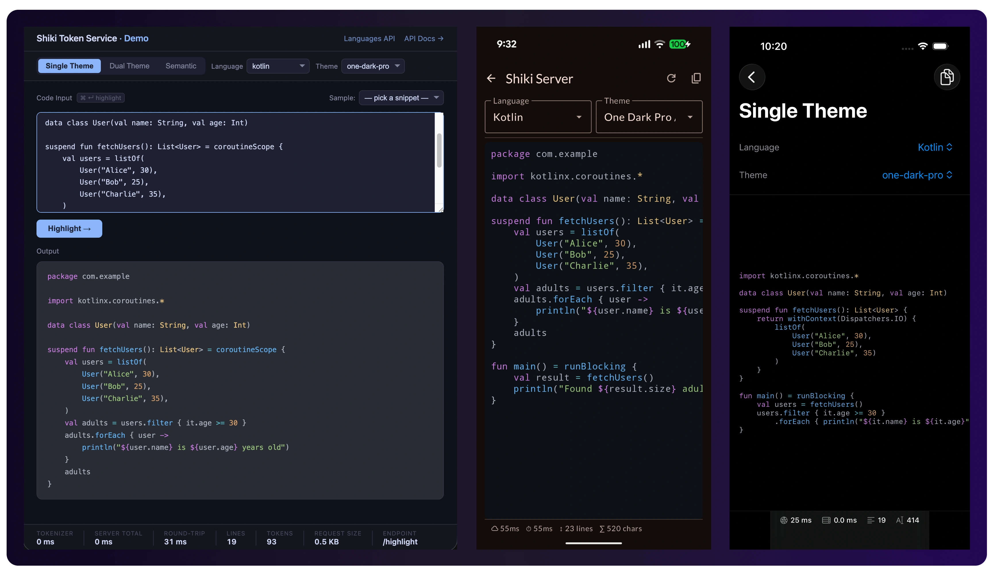

import GitHubEmbed from "@/components/GitHubEmbed.astro";

One weekend I started wondering what syntax highlighting in Jetpack Compose would look like if I built it from scratch today - no `WebView`, no HTML template strings. I'd done the `WebView` + PrismJS approach [back in 2020](/posts/source-code-syntax-highlighting-on-android-taking-full-control) and it worked, but it always felt a bit awkward to embed a browser engine just to display colored text. Now that Compose is the default UI toolkit, I wanted something that fit in naturally.

That curiosity led me down a rabbit hole involving [Shiki](https://shiki.style/), WebAssembly limitations, Cloudflare Workers, a small microservice, and eventually a second approach using TextMate grammars running entirely on-device. Here's how both ended up working.

## Why Shiki?

If you haven't come across Shiki before, it's a syntax highlighter based on TextMate grammars and themes - the same engine that powers VS Code's syntax highlighting. They're not the same thing, but they share the same underlying approach, which means the output quality is genuinely excellent. Colors match what you'd see in your editor.

The other thing I liked is that it supports dual-theme responses out of the box. You can ask it to tokenize code once and get back both dark and light colors for every token in a single response. That's perfect for Android apps that respect the system dark/light mode.

The catch? Shiki relies on Oniguruma, a regex engine that gets compiled to WebAssembly at runtime. WebAssembly on Android isn't something you can just drop into an app - and there's no native Android port of Shiki. So running Shiki itself on-device isn't an option - but the TextMate grammar engine it's built on can run on Android, which turned out to be its own path worth exploring.

## Running Shiki server-side

The first approach: if Shiki can't run on Android, run it somewhere else and just send the result to the app.

I built a small microservice - [Shiki Token Service](https://github.com/hossain-khan/shiki-token-service) - that takes source code and returns the highlighted tokens as JSON. The app never does any parsing itself; it just receives a list of tokens, each with its text and color, and renders them.

The service is built with [Hono](https://hono.dev/) and runs on Cloudflare Workers. One interesting wrinkle: Cloudflare Workers also blocks WebAssembly instantiation, so I couldn't use Shiki's default WASM engine there either. The fix was to use Shiki's pre-compiled JavaScript regex engine (`@shikijs/langs-precompiled`), which transpiles all the grammar patterns at build time. No WASM needed, works everywhere, and cold starts are fast.

The API has three highlight endpoints:

- `POST /highlight` - single theme, returns `text` + `color` per token
- `POST /highlight/dual` - dark + light theme in one call, returns `text` + `darkColor` + `lightColor` per token
- `POST /highlight/semantic` - returns token types (`keyword`, `function`, `string`, etc.) instead of colors, for when you want to manage the palette yourself

I hosted the service at `https://syntax-highlight.gohk.xyz/docs`. It's on Cloudflare's free tier, so latency is low and there's no cost to keep it running.

Since it's just a REST API, it works for any client - Android, iOS, or web. I also built a companion [iOS demo](https://github.com/hossain-khan/ios-syntax-highlighter-swift) using the same service with SwiftUI, which follows the same pattern: call the `/highlight/dual` endpoint, get tokens back, render with `AttributedString`.



## The Android side

The Compose implementation turns out to be pretty clean. The `/highlight/dual` endpoint returns a `HighlightDualResponse` containing a 2D array of tokens (lines of tokens), and each token carries a `darkColor` and `lightColor` hex string. From there it's just building a Compose `AnnotatedString` using a `parseHexColor` helper:

```kotlin
private fun buildAnnotatedStringFromDualResponse(
    response: HighlightDualResponse,
    isDark: Boolean,
): AnnotatedString = buildAnnotatedString {
    response.tokens.forEachIndexed { lineIndex, line ->
        line.forEach { token ->
            val hex = if (isDark) token.darkColor else token.lightColor
            val color = parseHexColor(hex)
            withStyle(SpanStyle(color = color)) {
                append(token.text)
            }
        }
        if (lineIndex < response.tokens.lastIndex) {
            append("\n")
        }
    }
}

private fun parseHexColor(hex: String): Color {
    val clean = hex.trimStart('#')
    return when (clean.length) {
        6, 8 -> Color(android.graphics.Color.parseColor("#$clean"))
        else -> Color.Unspecified
    }
}
```

Then rendering it is just:

```kotlin
Text(
    text = annotated,
    style = MaterialTheme.typography.bodySmall.copy(
        fontFamily = FontFamily.Monospace
    )
)
```

No `WebView`, no JavaScript bridge, no HTML template string. Just an `AnnotatedString` in a `Text` composable - with a background color approximated from the theme. I was pleasantly surprised by how little code this ended up being.

> 💡 The dual-theme endpoint is worth using even if your app only supports one theme right now. If you ever add dark mode support later, you already have both colors sitting in the response.

## the Kotlin SDK

Rather than calling the REST API directly with Retrofit or Ktor, there's an Android SDK available via JitPack. In the repo, `ShikiRepositoryImpl` wraps the `ShikiClient` and exposes a single `highlightDual` suspend function:

```kotlin
// settings.gradle.kts
dependencyResolutionManagement {
    repositories {
        maven("https://jitpack.io")
    }
}

// build.gradle.kts
dependencies {
    implementation("com.github.hossain-khan.shiki-token-service:sdk-android:sdk-1.0.5")
}
```

Usage is straightforward - all the client methods are `suspend` functions and return `kotlin.Result<T>`:

```kotlin
private val client = ShikiClient(baseUrl = "https://syntax-highlight.gohk.xyz")

suspend fun highlightDual(
    code: String,
    language: String,
    darkTheme: String,
    lightTheme: String,
): Result<HighlightDualResponse> =
    client.highlightDual(
        HighlightDualRequest(
            code = code,
            language = language,
            darkTheme = darkTheme,
            lightTheme = lightTheme,
        ),
    )
```

And calling it from the presenter:

```kotlin
shikiRepository
    .highlightDual(
        code = selectedSample.code,
        language = selectedSample.language,
        darkTheme = selectedThemePair.dark,
        lightTheme = selectedThemePair.light,
    ).onSuccess { response ->
        // response is HighlightDualResponse
        // pass to UI state, build AnnotatedString on the UI side
    }.onFailure { errorMessage = it.message ?: "Unknown error" }
```

The SDK uses Ktor with OkHttp under the hood on Android, and `kotlinx.serialization` for JSON. It's a Kotlin Multiplatform module, so it works in JVM projects too.

## Plain text fallback

One thing worth having in your implementation is a plain-text fallback for when the device is offline or the service is unavailable. In the demo app this is handled by the `Error` state - it falls back to showing the raw code using the same `Text` composable but without any `AnnotatedString` coloring:

```kotlin
when (state) {
    is State.Success -> {
        val isDark = isSystemInDarkTheme()
        val annotated = buildAnnotatedStringFromDualResponse(state.response, isDark)
        Text(
            text = annotated,
            style = MaterialTheme.typography.bodySmall.copy(
                fontFamily = FontFamily.Monospace
            )
        )
    }
    is State.Error -> {
        // plain text fallback when highlighting is unavailable
        Text(
            text = state.selectedSample.code,
            style = MaterialTheme.typography.bodySmall.copy(
                fontFamily = FontFamily.Monospace
            ),
            modifier = Modifier.background(MaterialTheme.colorScheme.surfaceVariant),
        )
    }
}
```

The demo app shows API latency, line count, and character count alongside the highlighted output - handy for getting a feel for how the service performs on real devices.

## On-device with `kotlin-textmate` library

While I was building the server-driven approach I also came across [kotlin-textmate](https://github.com/ivan-magda/kotlin-textmate) - a Kotlin port of the TextMate grammar engine. Since Shiki is built on TextMate grammars and themes, the output quality is essentially the same. The difference is that everything runs on-device with zero network calls.

The setup is a bit different from the Shiki approach. Grammar files (`.tmLanguage.json`) and theme files ship in the app's `assets/` folder. At runtime you load them from there, hand them to `CodeHighlighter`, and call `highlight()`:

```kotlin
// Load grammar and theme from assets (do this on a background thread)
val grammar = GrammarReader.readGrammar(
    assets.open("grammars/kotlin.tmLanguage.json")
)
val theme = ThemeReader.readTheme(
    assets.open("themes/dark_vs.json"),
    assets.open("themes/dark_plus.json"),
)

// Tokenize entirely on-device - no network call
val annotated = CodeHighlighter(grammar, theme).highlight(code)

// Render exactly the same way as the server approach
Text(
    text = annotated,
    style = MaterialTheme.typography.bodySmall.copy(
        fontFamily = FontFamily.Monospace
    )
)
```

The `highlight()` call returns a Compose `AnnotatedString` directly - same as what the Shiki path produces. So the rendering layer is identical; only the data source changes.

The honest tradeoff here is APK size. Grammar and theme files add a few hundred KB per language, which can add up if you need broad language support. For a few well-known languages it's not a problem at all.

> 💡 `kotlin-textmate` is bundled as local JARs in the demo app (`app/libs/`) since it isn't currently published to Maven Central or JitPack. Check the repo's `app/libs/` directory for the JARs.

## compared to the old approach

The WebView approach from 2020 still works - and if you need to support older Views-based layouts, it's still a reasonable option. But having now tried three different approaches, the Compose-native options are noticeably cleaner. No WebView overhead, rendering is pure Compose, and since the result is just an `AnnotatedString` it behaves like any other text - you can select it, layer more spans on top, put it inside a `LazyColumn`, whatever.

Between the two Compose paths:

- The server-driven Shiki approach is easier to set up. No grammar files to manage, language/theme support is handled server-side, and you get the full Shiki theme catalog. The tradeoff is the network dependency - it adds latency and needs a fallback for offline use.
- The on-device TextMate approach is the right call when offline support matters or when you want zero latency (think keystroke-level feedback in a code editor). Grammar files add a bit to APK size, but for a handful of languages that's usually fine.

Both produce the same `AnnotatedString` and render through the same `Text` composable, so switching between them is mostly a data-layer swap.

---

All three projects are available on GitHub. The token service repo also has a KMP SDK in the `sdk/` directory if you want to dig into how it's structured.

<GitHubEmbed repo="hossain-khan/shiki-token-service" />

<GitHubEmbed repo="hossain-khan/android-syntax-highlighter-compose" />

<GitHubEmbed repo="hossain-khan/ios-syntax-highlighter-swift" />

If something's not working or you run into issues, drop a comment or open a GitHub issue. Hope it helps somebody. ✌️
