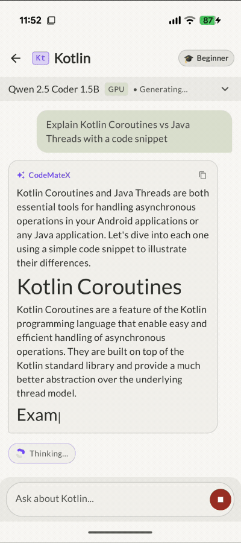

I've been experimenting with on-device LLM that can help with different programming languages that provides code-snippets along with explanations.
So, naturally I wanted to plug-in my [`compose-highlight`](/posts/syntax-highlighting-on-android-highlight-js-native-compose-engine) library to render code snippets in my AI Chat App.

## Initial integration

I was using Mike Penz's [multiplatform-markdown-renderer](https://github.com/mikepenz/multiplatform-markdown-renderer) to render streaming markdown, with code rendering plugin.

Replacing the markdown code renderer was straightforward. In [PR #222](https://github.com/hossain-khan/android-code-with-ai/pull/222), I added the `dev.hossain:compose-highlight:0.33.0` to the project.

In `MarkdownMessage.kt`, I inspected the markdown AST nodes to extract language tags and code content, wrapped `MainActivity` in `HighlightThemeProvider` so all chat bubbles would share a single background engine instance, and rendered the code blocks with `SyntaxHighlightedCode`:

```kotlin
SyntaxHighlightedCode(
    code = codeBlockContent,
    language = languageTag,
)
```

I ran the app and the highlighting worked, with some caveats 😅

## When static highlighting meets ~20 tokens a second

When an LLM generates a response, it streams tokens piece by piece at 10 to 30 tokens/sec. In Compose, that means the `codeBlockContent` string property updates multiple times every second.

The `SyntaxHighlightedCode` was designed under the assumption of static or occasionally updated snippets. So, clearly the initial attempt failed with flashing highlighting almost every 100ms. Not a great experience as seen below:



## Borrowing an idea from the text editor

While staring at the flashing code blocks, I remembered that I had already dealt with a very similar problem earlier when building [`SyntaxHighlightedTextEditor`](https://hossain-khan.github.io/android-compose-highlight/reference/syntax-highlighted-text-editor/).

In an interactive code editor, you can't run full syntax highlighting on every single keystroke. The editor solved this by snapshotting the styled spans: as you type, new keystrokes render immediately, while previously styled text keeps its spans until debounce pass catches up.

Instead of inventing something complex from scratch for streaming text, I ported that snapshotting concept over to create `StreamingSyntaxHighlightedCode`:

- As each new token arrives, the text updates on screen immediately with 0 ms UI delay.
- The highlighting pass is run only when the debounce delay passes.
- The previous lines retain their syntax coloring from the last snapshot, so there's zero visual reset or flash back to plain text.

## The newline insight

Originally, the plan was simple: debounce the highlight call by 200 ms, expecting the engine to highlight when the model pauses or takes a breath.

In practice, that **didn't work**. The LLM streams tokens so continuously (every 30 to 50 ms) that the 200 ms debounce timer was constantly reset. Because the idle threshold was never reached during active generation, highlighting only happened at the very end when the code block closed.

Then the obvious clicked: **code is structured by lines**.

Even while tokens stream continuously, a newline character (`\n`) signals that a previous line is structurally complete. Keywords, variable names, and string literals on that line aren't going to change anymore.

In [PR #441](https://github.com/hossain-khan/android-compose-highlight/pull/441), I added newline-aware triggering with progressive backfilling:

```kotlin
// When triggerOnNewline is true (default):
// 1. Seeing a '\n' immediately schedules a background highlight run.
// 2. minThrottleMs (150ms) prevents overloading the engine during rapid bursts.
// 3. debounceMs (200ms) handles pauses mid-line.
```

As the model streams code:

- New characters appear instantly on the active line.
- The moment the model hits Enter, that completed line gets queued for syntax highlighting.
- By the time the reader looks up at the previous line, it has already snapped into full syntax colors, even while the cursor is busily generating the next line below it.

I also had to fix horizontal scrolling. If a long line streams past the visible edge, standard Compose layout measurements can yank the horizontal scroll position. `StreamingSyntaxHighlightedCode` locks scroll stability so the reader can actually read while text streams in.

## Bringing it back into the chat app

With `compose-highlight` 0.34.0 published, I returned to **CodeMateX** app in [PR #223](https://github.com/hossain-khan/android-code-with-ai/pull/223) to swap out the composable:

```kotlin
StreamingSyntaxHighlightedCode(
    code = codeBlockContent,
    language = languageTag,
    showLineNumbers = true,
    debounceMs = 200L,
    triggerOnNewline = true,
)
```

The difference was night and day. No frame drops, no flickering re-renders, and no unstyled text waiting around until the response ends. Code streams in smoothly at 60 fps, with prior lines progressively colored in the background.

## Wrapping up

Dogfooding your own libraries in real applications is humbling. On paper, `SyntaxHighlightedCode` did everything I originally set out to build. But the moment I put it in a real-world scenario with streaming AI text, its architectural assumptions fell apart.

`StreamingSyntaxHighlightedCode` is now available in `dev.hossain:compose-highlight:0.34.0+` under the `@ExperimentalHighlightApi` annotation while I continue to refine the API surface.

If you're building an AI chat client, a developer tool, or any Compose app that deals with streaming code blocks, check out the [streaming documentation](https://hossain-khan.github.io/android-compose-highlight/reference/streaming-syntax-highlighted-code/) and give it a try.

If you test it or run into edge cases, feel free to [open an issue on GitHub](https://github.com/hossain-khan/android-compose-highlight/issues). Happy coding! ✌️
